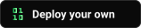

<div align="center">
  <h1> Context Use</h1>
  <p><em>Personal hypermedia for human-agent collaboration.</em></p>

  

[**View the Steve Jobs demo**](https://demo.context-use.com/map)

[](https://app.nibrun.com/deploy?name=context-use&binary=https%3A%2F%2Fgithub.com%2Fmassimoalbarello%2Fcontext-use%2Freleases%2Fdownload%2Fnibrun-latest%2Fcontext-use&port=3000&minimal)

</div>

## Run it locally
```sh
bun install
cp apps/context-use/.env.example apps/context-use/.env
bun run dev
```

Local face recognition is optional. To enable it, run
`bun --filter @repo/context-use build:faces:host` with CMake 3.24+ and a C++ toolchain installed,
then retry image processing. Full compiler output is saved in `.cache/face-build-host/build.log`.

Open [http://localhost:5173](http://localhost:5173). The first person to register a passkey becomes
the owner of the instance. Context Use generates its auth secret inside the configured `data/`
directory; set `BETTER_AUTH_SECRET` only when you need to supply your own.

To explore Steve Jobs' context from iPod to iPhone (2001–2007), run
`bun run dev:isolated:seeded` with Chrome and browser-harness available. Stop the ordinary dev server
first. The command registers a real passkey and loads the story into temporary storage, which is
deleted when it stops.

## Deploy it on nibrun

[nibrun](https://github.com/ilbertt/nibrun) runs Context Use as one small server with an HTTPS URL
and persistent storage. Use the button above for the first deployment, then update that same app
with the CLI. Install it and sign in once:
```sh
curl -fsSL https://nibrun.com/install.sh | sh
nib login
```
Each binary has its own build and deploy commands:

| App | Build a Linux binary | Deploy to nibrun |
| --- | --- | --- |
| Context Use instance | `bun run build:instance` | `bun run deploy:instance --new context-use` |
| Steve Jobs demo | `bun run build:demo` | `bun run deploy:demo --new steve-jobs-demo` |
| Project landing page | `bun run build:landing` | `bun run deploy:landing --new context-use-landing` |

Builds produce `apps/context-use/dist/context-use`, `apps/context-use/dist/context-use-demo`, and
`apps/landing/dist/context-use-landing`. Use `BUILD_TARGET=host` before a build command to compile
for your local machine. The instance's Linux build requires Docker for the native face engine;
the demo build uses CMake 3.24+ and a C++ toolchain to prepare its embedded snapshot.

Deploy commands build for Linux automatically. Use `--new <app-name>` to create an app; to
update an existing app, use `--app <app-name>` or its exact slug from `nib apps list`. For example:
```sh
bun run deploy:landing --app context-use-landing
```
An exact slug takes precedence. Otherwise the command resolves the name to a single app before
building. If several apps share that name, it stops and lists their exact slugs for you to choose.
If no app matches, it stops without creating an app.

The main app owns the backend, dashboard, and demo build target; the landing is a separate app.
Each binary ships independently. Context Use instances include the dashboard, while the demo embeds
its read-only snapshot and the landing page includes only the shared branding UI. Instance data,
uploaded files, OAuth credentials, and the generated auth secret live in nibrun's persistent
`/app/data` directory, so clients stay authorized across updates and restarts.
